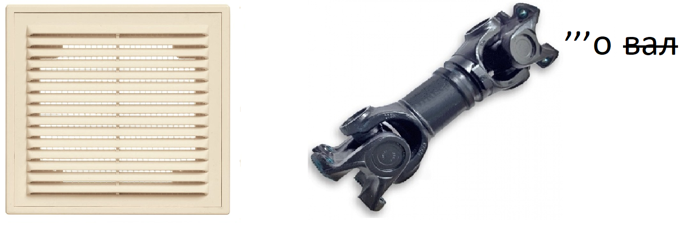

# Crypto tasks

## Разминка

### Условие

> Для начала решите вот этот разминочный таск на криптографию
>
> Код: [Тык](https://gist.github.com/greg0r0/f772f939bbdedcb209a9a7c104d24c62)
>
> Вывод: th_}n4yb3s{rts_vpp03_pr3mc0su_iy14trm

### Решение

Первым делом проанализируем код.
```python
data = input()
res = list(data)

if len(res) != 37:
    print("Bad Format")
    exit(1)

perm = [(0, 24), (1, 9), (2, 1), (3, 16), 
        (4, 10), (5, 21), (6, 8), (7, 35), 
        (8, 36), (9, 28), (10, 0), (11, 5), 
        (12, 12), (13, 30), (14, 26), (15, 4), 
        (16, 14), (17, 32), (18, 27), (19, 2), 
        (20, 15), (21, 19), (22, 11), (23, 31), 
        (24, 29), (25, 7), (26, 33), (27, 13), 
        (28, 23), (29, 20), (30, 25), (31, 22), 
        (32, 6), (33, 17), (34, 34), (35, 18), (36, 3)]

for i in perm:
    res[ i[1] ] = data[ i[0] ]

print( ''.join(res) )
```
Проанализировав его мы можем понять, что это обычный шифр перестановки. Чтобы расшифровать сообщение нам просто нужно поменять местами 0 и 1 в 19-й строке кода.

Код теперь выглядит так:
```python
data = "th_}n4yb3s{rts_vpp03_pr3mc0su_iy14trm"
res = list(data)

if len(res) != 37:
    print("Bad Format")
    exit(1)

perm = [(0, 24), (1, 9), (2, 1), (3, 16), 
        (4, 10), (5, 21), (6, 8), (7, 35), 
        (8, 36), (9, 28), (10, 0), (11, 5), 
        (12, 12), (13, 30), (14, 26), (15, 4), 
        (16, 14), (17, 32), (18, 27), (19, 2), 
        (20, 15), (21, 19), (22, 11), (23, 31), 
        (24, 29), (25, 7), (26, 33), (27, 13), 
        (28, 23), (29, 20), (30, 25), (31, 22), 
        (32, 6), (33, 17), (34, 34), (35, 18), (36, 3)]

for i in perm:
    res[ i[0] ] = data[ i[1] ]

print( ''.join(res) )
```
### Флаг

**mshp{p3rmut4ti0n_1s_v3ry_b4s3_crypt0}**

***

## Классический микс крипты

### Условие

> Миксер хорошо помешал флаг, что даже плоховидящий сможет его прочитать. 
Раздобудьте флаг. Формат флага mshp{}

[Файл](files/mixed/mixed.txt)

### Решение

Нам дан файл, в котором используются символы из шрифта Брайля. Переведём из Брайля и увидим следующую строку:
```
40545A4244406E3A5D55407234595A40526B5A5A3D462A475F3D462A475A3A2E4A3F313E242B4B5139696A32693D3E4F4B2B3E2421526E39696A32613D602457533E242B4E5B
```
Тут видны символы шестнадцатиричной СС. Переведём из неё в текст:
```
@TZBD@n:]U@r4YZ@RkZZ=F*G_=F*GZ:.J?1>$+KQ9ij2i=>OK+>$!Rn9ij2a=`$WS>$+N[
```
В таком виде текст может быть только в кодировке base85. Переведём из неё и получим строку base64:
```
bXNocHticmExbGxlXzFzXzFuNGVyZXM0MW5nX3doZW5fMW5fYmFzZXN9
```
Переведём из base64 и получим флаг
### Флаг

**mshp{bra1lle_1s_1n4eres41ng_when_1n_bases}**

***

## Shuffled

### Условие

> С моим флагом что-то произошло... Восстановишь?

[Файл](files/shuffled/source.py)

### Решение

Откроем и проанализируем код:

```python
from random import shuffle

flag = b'????????????????????????'

keys = [
    '6fc5741c849d44c875bd3bedeb1ece6fb37afa25aa6a0c0061d42c691e4ca4',
    'e7ea79cacad0c1518d811ad6d295555c709d90c12368c60003670d82c2146a',
    '71053c2caafc3106c1c712e711e34340a2e618bf2b70dab41a4d5e640bebe1',
    'ba4f1d8a2278838281caf004e01f59e6a39100fa045cbfba4b5b2bdaa41eea',
    'dd07db90ed34f20f1e8978376771459f4c84670917bc6978989306c9282b45',
    '5791e3de8fd76510c5aa790f4ed78df5999817f7c2a6cc0f573f648f47359b',
    '4814a7ca7bc475995417fc4eb9b5f77db64a94724380f0969613d2bb870cea',
    'ab0d96a219466c9aa7ce8247b23692804d6eb7cc5f6841dacc74919f0de2e0',
    'b8f691eaa7cd4b819137fc014bef103b97bb909891960bd4307f4e4df63710',
    'd0ee8b6d7db57b5236a02d19eb202a49a0af59a689c2c64361a84b94a5659d',
    '3a2c72481763002dcc94205588d1885425bba457c886d6670bd25eb165ec90',
    '8f9184b5ff102c62354404cec3553f079224489ae57788388a2328ee69d635',
    '36d5035fd09fa709f65c9a2efdf706de338621a79524f8bce56fcb080fae33',
    'b8de9605ff0ba967dc6aba568c7883041c19ed37174505328c0ac04c389f4d',
    'e37bfeee3859495efde03b1537d4c4bba0a67bd48f4000a558908670f4079d',
    'b83152df0e100afea02e027ff6b818f22622b2f6f2b0fae95e83cfe4f9d385',
]  # ключи

shuffle(keys)  # перемешивание ключей

for key in keys:
    key = bytes.fromhex(key)  # перевод ключей из hex
    flag = [x ^ y for x, y in zip(key, flag)]  # обычный xor флага с рандомным ключом

print(flag)
# [79, 125, 152, 55, 150, 10, 128, 103, 205, 43, 52, 72, 130, 137, 150, 196, 154, 85, 96, 212, 209, 141, 93, 96, 109, 86, 116, 20, 148, 184, 34] - вывод программы
```
Т.к. здесь используется xor, то неважно в каком порядке строка будет шифроваться и дешифроваться. Таким образом можно просто подставить вывод программы в ввод и получить флаг. Пример кода:
```python
from random import shuffle

flag = bytes([79, 125, 152, 55, 150, 10, 128, 103, 205, 43, 52, 72, 130, 137, 150, 196, 154, 85, 96, 212, 209, 141, 93, 96, 109, 86, 116, 20, 148, 184, 34])

keys = [
    '6fc5741c849d44c875bd3bedeb1ece6fb37afa25aa6a0c0061d42c691e4ca4',
    'e7ea79cacad0c1518d811ad6d295555c709d90c12368c60003670d82c2146a',
    '71053c2caafc3106c1c712e711e34340a2e618bf2b70dab41a4d5e640bebe1',
    'ba4f1d8a2278838281caf004e01f59e6a39100fa045cbfba4b5b2bdaa41eea',
    'dd07db90ed34f20f1e8978376771459f4c84670917bc6978989306c9282b45',
    '5791e3de8fd76510c5aa790f4ed78df5999817f7c2a6cc0f573f648f47359b',
    '4814a7ca7bc475995417fc4eb9b5f77db64a94724380f0969613d2bb870cea',
    'ab0d96a219466c9aa7ce8247b23692804d6eb7cc5f6841dacc74919f0de2e0',
    'b8f691eaa7cd4b819137fc014bef103b97bb909891960bd4307f4e4df63710',
    'd0ee8b6d7db57b5236a02d19eb202a49a0af59a689c2c64361a84b94a5659d',
    '3a2c72481763002dcc94205588d1885425bba457c886d6670bd25eb165ec90',
    '8f9184b5ff102c62354404cec3553f079224489ae57788388a2328ee69d635',
    '36d5035fd09fa709f65c9a2efdf706de338621a79524f8bce56fcb080fae33',
    'b8de9605ff0ba967dc6aba568c7883041c19ed37174505328c0ac04c389f4d',
    'e37bfeee3859495efde03b1537d4c4bba0a67bd48f4000a558908670f4079d',
    'b83152df0e100afea02e027ff6b818f22622b2f6f2b0fae95e83cfe4f9d385',
]

shuffle(keys)

for key in keys:
    key = bytes.fromhex(key)
    flag = [x ^ y for x, y in zip(key, flag)]

print(''.join(list(map(chr, flag))))

```

### Флаг

**mshp{th4t_d03snt_matter_th0ugh}**

***

## What?

### Условие




### Решение
Первым делом решим ребус: Первая картинка (таблица) нам пока что не понадобится. На второй картинке слева мы видим решётку, а справа можно загуглить, что это за деталь. Узнаём, что эта деталь называется карданный вал. Решив ребус мы получим подсказку: Решётка кардано.
Загуглим, что это такое и найдём информацию о том, как это надо расшифровывать

После прочтения можно попытаться расшифровать эту решётку. Если немного порисовать, то можно понять, что решётка должна  выглядеть так:

(Извините за шакальное качество)


После получения первой части флага повернём решетку и получим вторую часть флага


Повторим действия ещё 2 раза и получим полный флаг


### Флаг

**mshp{its_simple}**

***