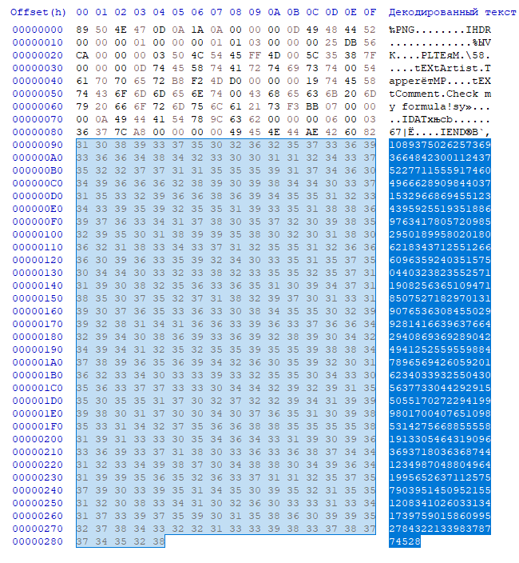
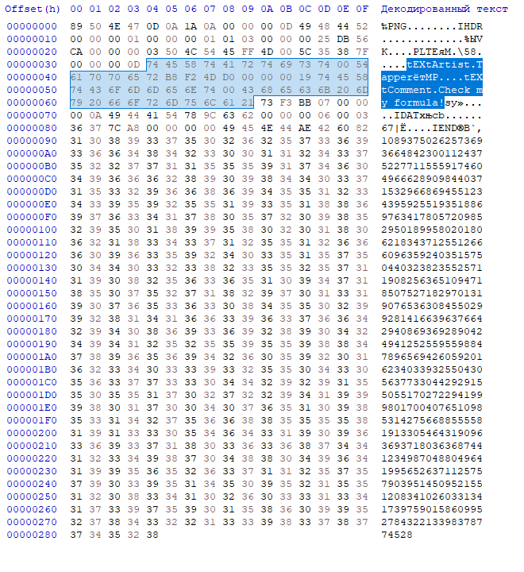
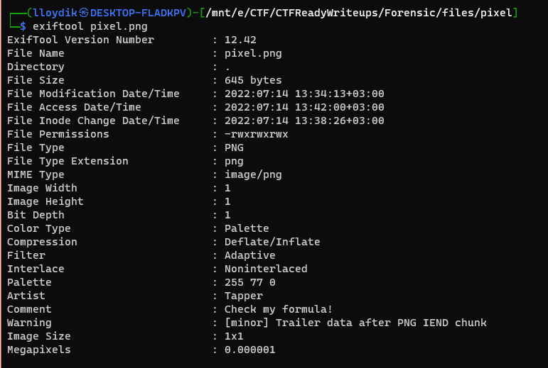

# Forensic tasks

## Пиксель

### Условие

> Это просто пиксель. Ничего особенного. Хотя его размеры должны были быть что-то вроде 106х17 ...

[Файл](files/pixel/pixel.png)

### Решение

Т.к. категория таска - Форензика, то первым делом откроем файл в hex-редакторе. Там мы увидим странное число, такого в обычных изображениях не бывает...



Также в таске есть хинты, которые нам подсказывают автора и коментарий



Ещё эти хинты можно добыть из exiftool'а



Далее находим формулу Таппера и тулзу, которая сможет из числа сделать флажок: https://tuppers-formula.ovh/

### Флаг

**mshp{strange_form}**

***

## Deep Space

### Условие

> Как глубоко вы можете взглянуть в слова?...

[Файл](files/Deep%20Space/task.txt)

### Решение

Т.к. категория таска - Форензика, то первым делом откроем файл в hex-редакторе. 


Здесь мы видим текст, в котором есть 2 типа пробелов. Один из них даёт в hex 20, а другой C2 A0, что странно. Если посмотреть внимательно, то других видов пробелов нет, что наталкивает на мысль о бинарной СС. Если заменить пробелы C2 A0 на 1, а обычные на 0, то мы получим бинарную строку. Напишем код:

```python
import string
with open('task.txt', 'r+') as f:
    data = f.read().encode()

data = data.replace(b'\xd0\x92\xc2\xa0', b'1')  # В питоне C2 A0 почему-то D0 92 C2 A0, но не суть
data = data.replace(b' ', b'0')
for alpha in string.ascii_letters + string.punctuation:
    alpha = alpha.encode()
    if alpha in data:
        data = data.replace(alpha, b'')

print(data)
```

Получилась такая строка: 

```
010011010101001101001000010100000111101101101101010000000110111001011001010111110110010000110001011001100110011000110011011100100011001101101110010101000101111101110011010100000100000001100011001100110101001101111101
```

Переведём эту строку из 2-й СС и получим флаг

### Флаг
**MSHP{m@nY_d1ff3r3nT_sP@c3S}**
