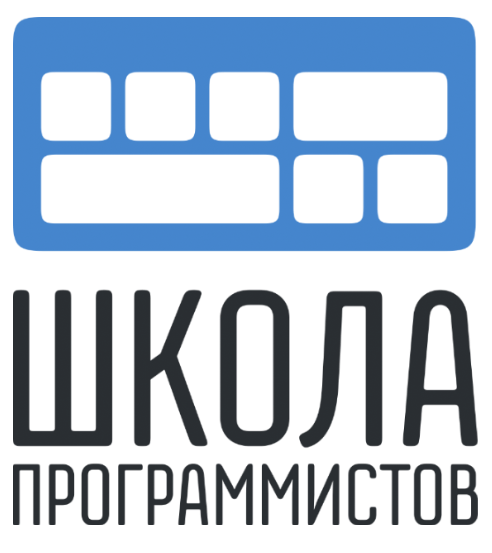

# CTF.Ready Летний лагерь Школы Программистов

В этом репозитории размещены райтапы на таски, которые вы решали в последний день летнего лагеря. Обычно райтапы делают сами участники, но их могут сделать и организаторы. Если хотите посмотреть, каким образом они должны были решаться, то вы по адресу. Каждая директория олицетворяет категорию. В каждой директории есть файл README.md, в нём райтапы на все таски той или иной категории. 

  

