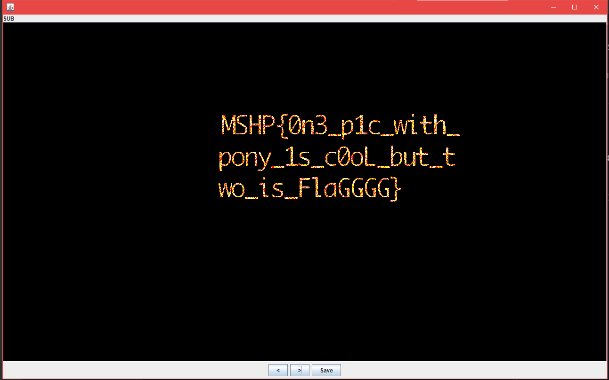
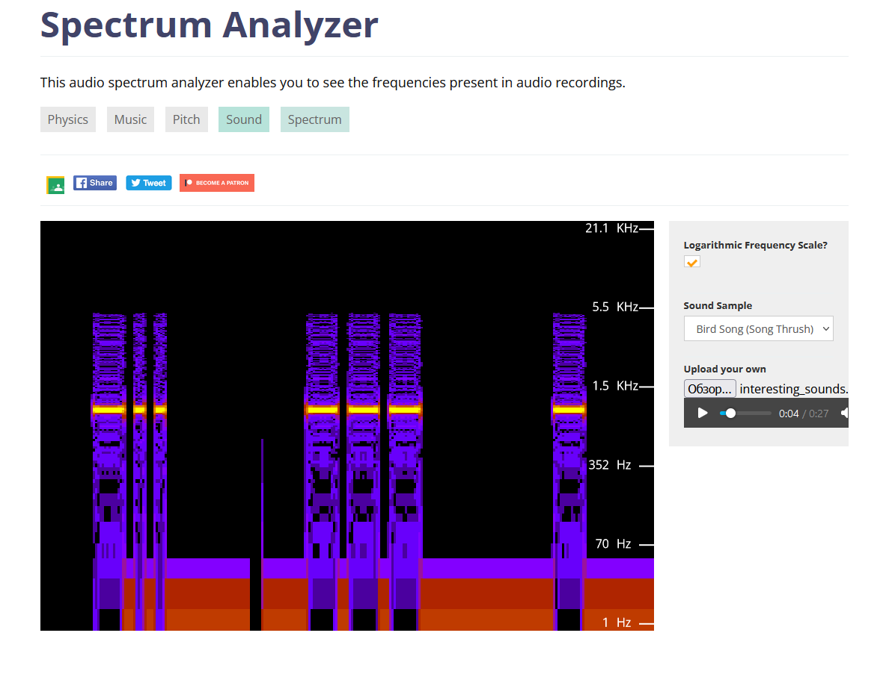

# Stego tasks

## Три картинки

### Условие

Картинка+Картинка+Картинка=Флаг

[pony.png](files/3pics/pony.png)
[task.png](files/3pics/task.png)

### Решение

Когда в таске есть 2 картинки, то это заставляет задуматься ою использовании image combiner в stegsolve. Открыв в stegsolve файл pony.png, открываем в image combiner файл task.png. Мотаем до метода SUB и получаем флаг

### Флаг

**MSHP{0n3_p1c_with_pony_1s_c0oL_but_two_is_FlaGGGG}**

***

## Based On Emoji (UCUCUGA ATTENTION!)

### Условие

Уцуцужные таски на кодировки при помощи emoji - неотъемлемая часть любого курса SHPCTF.

🚼🕡🅰🙌💖📵🌜🐎🕖📵🏠👒💍💩🚢👈🎎🍺🚢👒🎎📄🏦🚒🏠💭🐊📫

### Решение

Из названия таска можно догадаться, что используется base и emoji. Попробуем загуглить `base emoji converter`. По этому запросу найдётся сайт: https://codesandbox.io/s/k2v67y99po
Там мы вставляем в правое поле эмодзи и получаем флаг

### Флаг

**MSHP{b@s3d_0n_3moj1}**

***

## Интересная музыка

### Условие

Старенькие передачи до сих пор в моде. Сможете ли вы найти флаг? Полученную строку в upper case обернуть в mshp{}.

[Файл](files/interesting_sounds/interesting_sounds.wav)

### Решение

Нам дан аудио файл в категории стеганография, что намекает нам на работу со спектром. Открываем любой анализатор спектра и смотрим на график. В качестве примера я взял [этот сайт](https://academo.org/demos/spectrum-analyzer/)

Закинув файл на анализ и включив его, мы можем увидеть такой график:

Напоминает азбуку Морзе. Если выписать длинные сигналы как тире, а короткие как точки, то получим флаг

### Флаг

**mshp{DOTDOTTEXTAGAIN}**